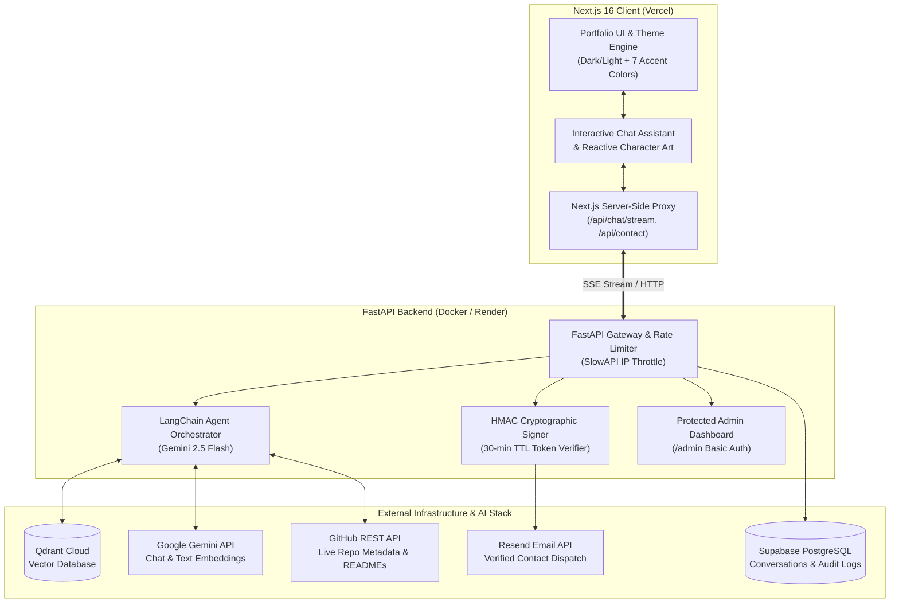

# 🚀 Vivek Macha — Interactive AI Portfolio & Autonomous Agent

<div align="center">

[](https://nextjs.org/)
[](https://react.dev/)
[](https://www.typescriptlang.org/)
[](https://fastapi.tiangolo.com/)
[](https://aistudio.google.com/)
[](https://qdrant.tech/)
[](https://supabase.com/)
[](https://www.docker.com/)

<p align="center">
  A production-grade, full-stack personal portfolio platform featuring a real-time autonomous AI assistant ("Ask Vivek"), semantic portfolio RAG search, live GitHub repository intelligence, cryptographically verified contact flows, and a dynamic theming system.
</p>

[Live Demo](#-live-demo) • [Architecture](#-system-architecture) • [Features](#-key-features) • [Quickstart](#-getting-started) • [API Specs](#-api-endpoints) • [Deployment](#-deployment)

</div>

---

## 🌟 Overview

This is not just a static resume website. It is an intelligent portfolio platform built with **Next.js 16 (App Router)** and a **FastAPI** AI service powered by **Google Gemini 2.5 Flash** and **LangChain**.

Visitors can seamlessly navigate Vivek's projects, skills, and background, or interact directly with **"Ask Vivek"** — an autonomous AI assistant that answers questions using vectorized semantic search, inspects GitHub repositories live, and prepares cryptographically signed email drafts with zero risk of unauthorized dispatch.

---

## 🏗️ System Architecture



---

## ✨ Key Features

### 🤖 1. Autonomous AI Assistant ("Ask Vivek")
- **Real-Time SSE Streaming**: Emits token-by-token text generation and status events (`tool_start`, `tool_end`, `token`, `done`) via Server-Sent Events.
- **Reactive Character Mascot**: An animated character visually transitions between states in real-time as the agent works:
  - 💤 **Idle**: Relaxed standing pose.
  - 💻 **Reading Repo**: Assistant typing at a laptop while querying GitHub.
  - 📄 **Searching Portfolio**: Assistant reviewing documents during RAG search.
  - ✉️ **Drafting Contact**: Assistant presenting an envelope when a message is ready.
  - ⚠️ **Error**: Alert state with graceful fallback guidance.

### 🔍 2. Semantic Portfolio RAG (Qdrant + Gemini Embeddings)
- Chunks and indexes portfolio content, work experience, achievements, and technical specializations in a **Qdrant** vector database.
- Uses `text-embedding-004` to perform high-accuracy similarity search.
- Prompt-grounded responses ensure the assistant only speaks with factual authority about Vivek's true background.

### 🐙 3. Live GitHub Repository Intelligence
- Direct read integration with the **GitHub REST API**.
- On-demand retrieval of live repository metadata, stars, topics, primary languages, and `README.md` documentation.
- **Strict Allowlist Guard**: The assistant can only query explicitly allowlisted repositories defined in `GITHUB_ALLOWED_REPOS`, preventing arbitrary external scraping.

### 🛡️ 4. Cryptographically Secured Contact Verification
- **No Unilateral AI Sending**: The model can draft messages, but code controls the send gate.
- **HMAC SHA-256 Signatures**: Drafts are serialized into signed tokens containing message text, recipient, and an explicit timestamp (expires in 30 minutes).
- **Two-Step Approval**: Visitors must inspect and click **"Confirm & Send"** on the generated preview. The backend verifies the HMAC signature before dispatching through **Resend**.

### 🎨 5. Dynamic Design & Theming Engine
- **Dark & Light Mode**: Seamless toggle with persistent `localStorage` preference.
- **7 Curated Accent Color Themes**:
  - 🟣 **Purple** (`#8B5CF6` — *Default*)
  - 🔵 **Cyan** (`#22D3EE`)
  - 🟡 **Yellow** (`#FFDB70`)
  - 🔷 **Blue** (`#3B82F6`)
  - 🟢 **Teal** (`#5EEAD4`)
  - 🌸 **Pink** (`#EC4899`)
  - 🍏 **Lime** (`#A3E635`)
- **Zero-Flash SSR Script**: Pre-hydration script in `layout.tsx` guarantees that the user's preferred theme renders instantly without flash-of-unstyled-content (FOUC).

### 📊 6. Analytics & Admin Dashboard
- Built-in `/admin` route inside FastAPI secured by **HTTP Basic Auth**.
- Inspect past visitor conversations, session metadata, tool invocation metrics, and incoming contact submissions in real-time.

### ⚡ 7. Production Hardening & Abuse Protection
- **SlowAPI Rate Limiting**: Enforces strict per-IP rate limits on AI chat routes to protect API quotas.
- **Next.js Server-Side Proxy**: Browser never communicates directly with backend services or third-party APIs, keeping CORS and backend topology internal.
- **Stateless Agent State**: Client supplies conversation turn history with each turn, ensuring zero memory leaks and resilience across server restarts.

---

## 📁 Repository Structure

```text
portfolio/
├── docker-compose.yml           # Unified orchestration for client & backend
├── render.yaml                  # Infrastructure-as-Code for Render backend deploy
├── README.md                    # Project documentation
│
├── client/                      # Next.js 16 Frontend Application
│   ├── app/
│   │   ├── api/                 # Edge/Node server proxy routes
│   │   │   ├── chat/stream/     # SSE streaming proxy to backend
│   │   │   ├── contact/         # Contact confirmation & dispatch proxy
│   │   │   └── health/          # Client & upstream healthcheck
│   │   ├── globals.css          # Design system, CSS tokens & typography
│   │   ├── layout.tsx           # Root layout, zero-flash script & metadata
│   │   └── page.tsx             # Main single-page portfolio layout
│   ├── components/              # Modular UI components
│   │   ├── AIAssistant.tsx      # Chat interface & SSE streaming engine
│   │   ├── CharacterArt.tsx     # Reactive AI mascot animator
│   │   ├── PortfolioPage.tsx    # Filterable project showcase
│   │   ├── SkillsSection.tsx    # Categorized skill badges & metrics
│   │   ├── ThemeBar.tsx         # Color swatch picker & mode switch
│   │   └── ThemeContext.tsx     # React theme & accent provider
│   ├── data/
│   │   └── portfolioData.ts     # Source of truth for portfolio UI content
│   ├── public/
│   │   └── images/              # Optimized assets, project previews, avatars
│   └── Dockerfile               # Production Next.js container build
│
└── backend/                     # FastAPI & LangChain AI Microservice
    ├── app/
    │   ├── agent/
    │   │   ├── orchestrator.py  # LangChain agent loop & SSE streaming
    │   │   └── tools.py         # RAG, GitHub & Email draft tool definitions
    │   ├── rag/
    │   │   ├── ingestion.py     # Document chunking & vectorization
    │   │   └── retrieval.py     # Qdrant semantic vector search
    │   ├── routers/
    │   │   ├── chat.py          # /chat & /chat/stream endpoints
    │   │   └── admin.py         # /admin monitoring dashboard
    │   ├── services/            # Clients for Gemini, GitHub, Resend, Supabase
    │   ├── config.py            # Pydantic Settings environment configuration
    │   ├── main.py              # FastAPI application initialization & CORS
    │   └── security.py          # HMAC signing, draft verification & basic auth
    ├── data/portfolio/          # Markdown documents indexed into Qdrant
    ├── scripts/                 # Ingestion & maintenance scripts
    ├── Dockerfile               # Python 3.12 production container build
    └── requirements.txt         # Pinned Python package dependencies
```

---

## 🛠️ Technology Stack

| Layer | Technology | Description |
| :--- | :--- | :--- |
| **Frontend Framework** | **Next.js 16.3 (App Router)** | Modern React framework with Turbopack and server proxy routes |
| **UI Library & Language** | **React 19 & TypeScript** | Strict type safety, functional component architecture |
| **Styling & Icons** | **Vanilla CSS Tokens + Ionicons** | Zero runtime CSS overhead with dynamic HSL CSS variable injection |
| **Backend Framework** | **FastAPI (Python 3.12)** | Asynchronous Python web framework with Uvicorn and SSE streaming |
| **LLM & Tool Orchestration**| **Google Gemini 2.5 Flash + LangChain** | Native function calling, tool binding, and streaming tokens |
| **Vector Database** | **Qdrant Cloud** | High-performance vector search engine for RAG knowledge retrieval |
| **Embeddings Model** | **text-embedding-004** | Google Cloud's state-of-the-art semantic text embedding model |
| **Database & Logging** | **Supabase (PostgreSQL)** | Session storage, conversation transcripts, and message audits |
| **Email Gateway** | **Resend API** | Reliable, verified transactional email delivery |
| **Containerization** | **Docker & Docker Compose** | Reproducible multi-service development and production deployment |

---

## 🚀 Getting Started

### Prerequisites
- [Docker Desktop](https://www.docker.com/products/docker-desktop/) (recommended)
- [Node.js](https://nodejs.org/) (v20+) & [npm](https://www.npmjs.com/)
- [Python](https://www.python.org/) (v3.12+)

---

### Option 1: Run with Docker Compose (Recommended)

To spin up the entire stack (FastAPI backend + Next.js client) simultaneously:

1. **Clone the repository**:
   ```bash
   git clone https://github.com/MachaVivek/portfolio.git
   cd portfolio
   ```

2. **Configure environment variables**:
   ```bash
   cp backend/.env.example backend/.env
   ```
   *(The backend is designed to boot gracefully even with empty keys, responding with informative fallback messages).*

3. **Start the containers**:
   ```bash
   docker compose up --build
   ```

4. **Access the applications**:
   - **Frontend**: [http://localhost:3000](http://localhost:3000)
   - **Backend API**: [http://localhost:8002](http://localhost:8002)
   - **Interactive API Docs (Swagger)**: [http://localhost:8002/docs](http://localhost:8002/docs)
   - **Admin Dashboard**: [http://localhost:8002/admin](http://localhost:8002/admin)

---

### Option 2: Local Development (Separate Services)

#### 1. Backend Setup
```bash
cd backend
python3 -m venv .venv
source .venv/bin/activate    # On Windows: .venv\Scripts\activate
pip install -r requirements.txt
cp .env.example .env

# Populate backend/.env with your API keys
uvicorn app.main:app --host 0.0.0.0 --port 8000 --reload
```

#### 2. Vector Database Ingestion (RAG Knowledge)
Once you have configured `GEMINI_API_KEY`, `QDRANT_URL`, and `QDRANT_API_KEY` in `backend/.env`:
```bash
# Ingest and embed the data/portfolio markdown files into Qdrant
python scripts/ingest_portfolio.py
```

#### 3. Frontend Setup
In a separate terminal window:
```bash
cd client
npm install
npm run dev
```
Open [http://localhost:3000](http://localhost:3000) in your browser.

---

## 🔐 Environment Variables Reference

### Backend (`backend/.env`)

| Variable | Required | Description |
| :--- | :---: | :--- |
| `ALLOWED_ORIGINS` | Yes | Comma-separated list of allowed origins (e.g. `http://localhost:3000`) |
| `SECRET_KEY` | Recommended | 32-byte secret key for signing HMAC email tokens (`python -c "import secrets; print(secrets.token_hex(32))"`) |
| `GEMINI_API_KEY` | Yes | Google AI Studio API key for Gemini 2.5 Flash and embeddings |
| `QDRANT_URL` | Optional | Qdrant Cloud cluster URL for semantic RAG search |
| `QDRANT_API_KEY` | Optional | Qdrant API key |
| `GITHUB_TOKEN` | Optional | GitHub Personal Access Token (read-only on public repos) |
| `GITHUB_USERNAME` | Optional | Target GitHub username for live repository inspects |
| `GITHUB_ALLOWED_REPOS`| Optional | Comma-separated allowlist of repository names the AI can inspect |
| `RESEND_API_KEY` | Optional | Resend API key for contact email delivery |
| `RESEND_FROM_EMAIL` | Optional | Verified sender address on your custom domain in Resend |
| `CONTACT_EMAIL_TO` | Optional | Destination inbox where contact submissions are forwarded |
| `SUPABASE_URL` | Optional | Supabase project URL for storing transcripts |
| `SUPABASE_KEY` | Optional | Supabase `service_role` secret key |
| `ADMIN_USERNAME` | Optional | Basic Auth username for `/admin` |
| `ADMIN_PASSWORD` | Optional | Basic Auth password for `/admin` |

### Client (`client/.env.local`)

| Variable | Required | Description |
| :--- | :---: | :--- |
| `BACKEND_URL` | Optional | Base URL of the backend API (Defaults to `http://localhost:8002` or `http://backend:8000`) |

---

## 📡 API Endpoints

| Method | Endpoint | Access | Description |
| :--- | :--- | :--- | :--- |
| `GET` | `/health` | Public | System status and external service connectivity diagnostics |
| `POST` | `/chat/stream` | Public | SSE streaming endpoint for multi-turn AI interactions |
| `POST` | `/chat` | Public | Synchronous response endpoint for conversational query |
| `POST` | `/contact/confirm` | Public | Validates HMAC signature and delivers approved contact email |
| `GET` | `/admin` | Basic Auth | Web dashboard to review conversations and submitted messages |
| `GET` | `/docs` | Public | Interactive OpenAPI / Swagger UI documentation |

---

## 🚢 Deployment

### Deploy Backend to Render
The repository includes a ready-to-use [`render.yaml`](render.yaml) specification:
1. Connect your GitHub repository to [Render](https://render.com/).
2. Create a new **Blueprint** service selecting `render.yaml`.
3. Add your production environment variables in the Render Dashboard.

### Deploy Frontend to Vercel
1. Import the repository on [Vercel](https://vercel.com/).
2. Set the **Root Directory** to `client`.
3. Set the Environment Variable:
   - `BACKEND_URL`: `https://your-backend-service.onrender.com`
4. Deploy!

---

## 👤 Author

**Vivek Macha**  
*Associate Software Engineer • Full Stack, AI & Mobile Systems*

- 🌐 **Portfolio**: [https://vivekmacha.com](https://github.com/MachaVivek/portfolio)
- 🐙 **GitHub**: [@MachaVivek](https://github.com/MachaVivek)
- 💼 **LinkedIn**: [Vivek Macha](https://www.linkedin.com/in/vivek-macha/)
- 💻 **LeetCode**: [machavivek19](https://leetcode.com/machavivek19/)
- 📧 **Email**: [machavivek19@gmail.com](mailto:machavivek19@gmail.com)

---

## 📄 License

This project is licensed under the [MIT License](LICENSE).
